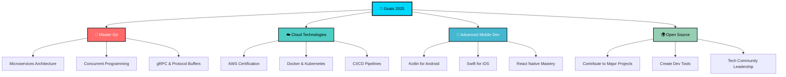

# 🚀 Estefany Torres Timaná

<div align="center">


[](https://git.io/typing-svg)


</div>

---

## 👋 ¡Hola Mundo! 

<div align="center">
<table>
<tr>
<td width="50%">

### 🙋‍♀️ Sobre Mí

```typescript
interface Developer {
  name: string;
  location: string;
  age: number;
  role: string[];
  passions: string[];
  currentLearning: string;
  lifePhilosophy: string;
}

const estefany: Developer = {
  name: "Estefany Torres Timaná",
  location: "Lima, Perú 🇵🇪",
  age: 23,
  role: ["Full Stack Developer", "Problem Solver"],
  passions: [
    "Clean Code", 
    "Innovation", 
    "Automation",
    "Continuous Learning"
  ],
  currentLearning: "Go & Microservices Architecture",
  lifePhilosophy: "Code is poetry, debug is therapy ✨"
};
```

</td>
<td width="50%">

### 📊 GitHub Analytics


</td>
</tr>
</table>
</div>

---

## 🛠️ Tech Arsenal 

<div align="center">

### 💻 Languages & Frameworks
<p>

</p>

### 🗄️ Databases & Tools
<p>

</p>

### 📈 Skill Levels


</div>

---

## 🏆 Featured Projects

<div align="center">
<table>
<tr>
<td width="33%">

### 📱 Task & Attendance System


**Stack:** React Native • Node.js • PostgreSQL  
**Features:**
- 📊 Interactive Dashboard
- 📈 Automated Reports  
- 📱 Cross-platform Mobile App
- 🔔 Real-time Notifications

[](https://github.com/estefanytorres31)

</td>
<td width="33%">

### 💰 Cashflow Management System


**Stack:** React Native • Node.js • MySQL  
**Features:**
- 📊 Dynamic Charts
- 💹 Financial Analytics
- 📤 Export Reports
- 🔐 Secure Transactions

[](https://github.com/estefanytorres31)

</td>
<td width="33%">

### 🛒 POS System


**Stack:** React Native • Node.js • PostgreSQL  
**Features:**
- 🛍️ Sales Management
- 📦 Inventory Control
- 📊 Business Analytics
- 🖨️ Receipt Generation

[](https://github.com/estefanytorres31)

</td>
</tr>
</table>
</div>

---

## 📊 GitHub Statistics

<div align="center">


</div>

<div align="center">

</div>

### 🏅 GitHub Trophies
<div align="center">

</div>

### 📈 Contribution Graph
<div align="center">

</div>

---

## 🎯 2025 Goals & Roadmap

<div align="center">



</div>

---

## 💡 Skills & Expertise

<div align="center">

### 🔥 Core Competencies

<table>
<tr>
<td width="33%" align="center">

**🎨 Frontend Development**
```javascript
const frontend = {
  frameworks: ['React', 'React Native'],
  styling: ['CSS3', 'Styled Components'],
  tools: ['Vite', 'Webpack'],
  mobile: ['iOS', 'Android'],
  ux: ['Responsive Design', 'Accessibility']
};
```

</td>
<td width="33%" align="center">

**⚡ Backend Development**
```python
backend = {
    'languages': ['Node.js', 'Python', 'Java', 'Go'],
    'frameworks': ['Express', 'Flask', 'Django', 'Spring'],
    'databases': ['PostgreSQL', 'MySQL'],
    'api': ['REST', 'GraphQL'],
    'architecture': ['Microservices', 'MVC']
}
```

</td>
<td width="33%" align="center">

**🛠️ DevOps & Tools**
```yaml
devops:
  version_control: [Git, GitHub]
  containers: [Docker]
  testing: [Jest, Pytest]
  ci_cd: [GitHub Actions]
  monitoring: [Postman]
  design: [Figma]
```

</td>
</tr>
</table>

### 📊 Skill Progress Bars


</div>

---

## 🌟 Soft Skills & Mindset

<div align="center">


### 🧠 Core Values

🎯 **Problem Solving** • 🤝 **Team Collaboration** • 📚 **Continuous Learning**  
💡 **Innovation** • 🎯 **Results-Oriented** • 🗣️ **Effective Communication**  
⚡ **Adaptability** • 🔍 **Attention to Detail** • 🚀 **Growth Mindset**

</div>

---

## 📫 Let's Connect!

<div align="center">

### 🌐 Find me around the web:

[](https://www.linkedin.com/in/estefany-torres-timan%C3%A1-aa192328a/)
[](https://github.com/estefanytorres31)
[](mailto:estefanyt3101@gmail.com)

### 💬 Get in touch!

```json
{
  "name": "Estefany Torres Timaná",
  "location": "Lima, Perú 🇵🇪",
  "email": "estefanyt3101@gmail.com",
  "timezone": "GMT-5",
  "languages": ["Spanish (Native)", "English (Professional)"],
  "availability": "Open to opportunities",
  "interests": ["Full Stack Development", "Automation", "Innovation"]
}
```

**💭 ¿Tienes un proyecto interesante? ¡Hablemos!**  
**🚀 Siempre estoy abierta a nuevas colaboraciones y desafíos.**

</div>

---

<div align="center">

### 💫 Fun Fact

> *"El código es poesía, cada función es un verso,  
> y cada bug es una oportunidad de hacer el código aún más hermoso."* ✨


**¡Gracias por visitar mi perfil! 🚀**


</div>
